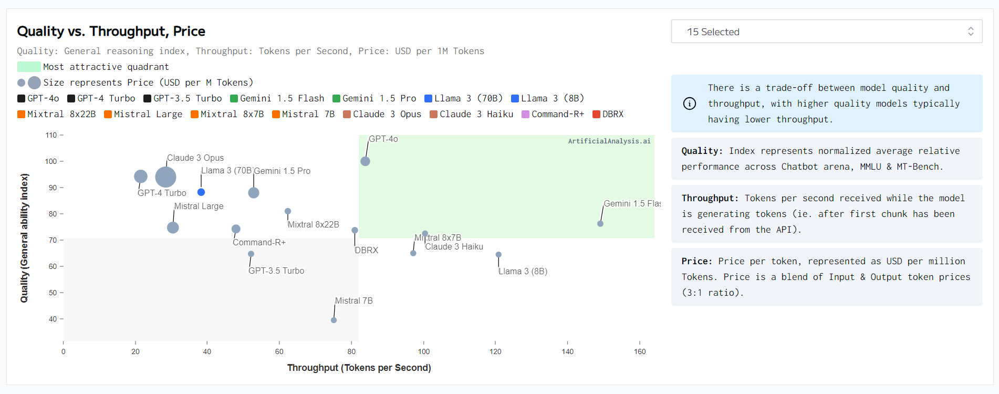

# awesome-LLMs-finetuning
Collection of resources for practitioners to play with Large Language Models (LLMs). This list includes tools, software, libraries, datasets, research papers, and other resources related to LLMs fine-tuning.

This repos serves as a collection of resources I've found while learning LLMs. I hope it helps you too!

## Most Recent Update & News:
- May 2024, add Kaggle & Colab Notebooks section.

## 1. LLM Performance & Concepts

Source: https://artificialanalysis.ai/models/llama-3-instruct-70b

- Leaderboards
  > - [Open LLM Leaderboard](https://huggingface.co/spaces/HuggingFaceH4/open_llm_leaderboard) - aims to track, rank and evaluate LLMs and chatbots as they are released.
  > - [Chatbot Arena Leaderboard](https://huggingface.co/spaces/lmsys/chatbot-arena-leaderboard) - a benchmark platform for large language models (LLMs) that features anonymous, randomized battles in a crowdsourced manner.
  > - [AlpacaEval Leaderboard](https://tatsu-lab.github.io/alpaca_eval/) - An Automatic Evaluator for Instruction-following Language Models
  > - [Open Ko-LLM Leaderboard](https://huggingface.co/spaces/upstage/open-ko-llm-leaderboard) -  The Open Ko-LLM Leaderboard objectively evaluates the performance of Korean Large Language Model (LLM).
  > - [Yet Another LLM Leaderboard](https://huggingface.co/spaces/mlabonne/Yet_Another_LLM_Leaderboard) - Leaderboard made with LLM AutoEval using Nous benchmark suite.
  > - [OpenCompass 2.0 LLM Leaderboard](https://rank.opencompass.org.cn/leaderboard-llm-v2) - OpenCompass is an LLM evaluation platform, supporting a wide range of models (InternLM2,GPT-4,LLaMa2, Qwen,GLM, Claude, etc) over 100+ datasets.

### Concepts
- RLHF - Reinforcement Learning from Human feedback
- **Alignment** in large language models (LLMs) refers to the degree to which the model's behavior aligns with human intentions, values, and goals. Alignment teaches the model the style or format for interacting with users, to expose the knowledge and capabilities that it has already learned during pretraining

### Kaggle & Colab Notebooks
- [Prompting Llama 3 like a Pro](https://www.kaggle.com/code/declanide/prompting-llama-3-like-a-pro)
- [LLaVa via Ollama - Image Annotation](https://www.kaggle.com/code/alfathterry/llava-via-ollama-image-annotation)

### Courses & Lectures
- [Stanford] CS224N-Lecture 11: Prompting, Instruction Finetuning, and RLHF [Slides](https://web.stanford.edu/class/archive/cs/cs224n/cs224n.1234/slides/cs224n-2023-lecture11-prompting-rlhf.pdf)
- [UWaterloo] CS 886: Recent Advances on Foundation Models [Homepage](https://cs.uwaterloo.ca/~wenhuche/teaching/cs886/)

### Blogs
- https://www.zhihu.com/question/655951646/answer/3498544864
- https://zhuanlan.zhihu.com/p/680955430

## 2. LLM Backbones
- Meta
    - LLaMA
        - [Llama 3](https://llama.meta.com/llama3/): Now available with both 8B and 70B pretrained and instruction-tuned versions to support a wide range of applications.
        - [Vicuna-13B](https://lmsys.org/blog/2023-03-30-vicuna/), an open-source chatbot trained by fine-tuning LLaMA on user-shared conversations collected from ShareGPT. 
    - [OPT](https://huggingface.co/docs/transformers/en/model_doc/opt) was proposed in Open Pre-trained Transformer Language Models by Meta AI. OPT is a series of open-sourced large causal language models which perform similar in performance to GPT3.
- Google
    - [Gemma](https://huggingface.co/blog/gemma) is a transformer-based large language model developed by Google AI (2B, 7B).
    - [PaLM](https://ai.google/discover/palm2/) is a 540 billion parameter transformer-based large language model developed by Google AI.
    - [Chinchilla](https://en.wikipedia.org/wiki/Chinchilla_(language_model)) is a family of large language models developed by the research team at DeepMind, presented in March 2022.
    - [T5](https://ai.googleblog.com/2020/02/exploring-transfer-learning-with-t5.html) is a large language model developed by Google AI. [T5](https://huggingface.co/docs/transformers/en/model_doc/t5), [FLAN-T5](https://huggingface.co/docs/transformers/en/model_doc/flan-t5), [T5-lm-adapt](https://huggingface.co/google/t5-base-lm-adapt)
- [Mistral AI](https://mistral.ai/)
    - [Mistral 7B](https://github.com/mistralai/mistral-src?tab=readme-ov-file)
- [Adept](https://www.adept.ai/blog/fuyu-8b)
    - [Fuyu](https://huggingface.co/adept/fuyu-8b), October 17, 2023, Adept AI announced the release of Fuyu, an 8 billion parameter language model.
- Shanghai AI Laboratory
    - [InternVL](https://github.com/OpenGVLab/InternVL)
    - [InternLM2](https://github.com/InternLM/InternLM) [paper](https://arxiv.org/abs/2403.17297)
- Phi-3: Phi-3 Mini is a 3.8B parameters, lightweight, state-of-the-art open model trained with the Phi-3 datasets that includes both synthetic data and the filtered publicly available websites data with a focus on high-quality and reasoning dense properties.
- [Qwen](https://github.com/QwenLM/Qwen) (通义千问) is the large language model family built by Alibaba Cloud.
- [PanGu-α](https://openi.org.cn/pangu/) - PanGu-α is a 200B parameter autoregressive pretrained Chinese language model develped by Huawei Noah's Ark Lab, MindSpore Team and Peng Cheng Laboratory.

### Multi-Modal LLMs
- [LLaVA](https://github.com/haotian-liu/LLaVA)
- [Flamingo](https://arxiv.org/abs/2204.14198)

## 3. LLM and Applications
### Unerstanding
- When IoT Meet LLMs: Applications and Challenges, IEEE International Conference on Big Data (IEEE BigData) 2024. [Paper](https://arxiv.org/abs/2411.17722)
- IoT-LLM: Enhancing Real-World IoT Task Reasoning with Large Language Models, 2024. [Paper](https://arxiv.org/abs/2410.02429)
- MultiIoT: Benchmarking Machine Learning for the Internet of Things, 2024. [Paper](https://arxiv.org/abs/2311.06217)
- 3D-LLM: Injecting the 3D World into Large Language Models, 2023. [Project](https://vis-www.cs.umass.edu/3dllm/)
- Point-bind & point-llm: Aligning point cloud with multi-modality for 3d understanding, generation, and instruction following, [Code](https://github.com/ZiyuGuo99/Point-Bind_Point-LLM)
- LiDAR-LLM: Exploring the Potential of Large Language Models for 3D LiDAR Understanding

### Embedding
- ULIP-2: Towards Scalable Multimodal Pre-training For 3D Understanding, CVPR 2024. [Code](https://github.com/salesforce/ULIP)
- Point-BERT: Pre-Training 3D Point Cloud Transformers with Masked Point Modeling, CVPR 2022. [Code](https://github.com/lulutang0608/Point-BERT)

### 2D & 3D Generation
Since 2D and 3D generation are closely related, we list some of the most recent works in both areas.
- V3D: Video Diffusion Models are Effective 3D Generators, 2024. [Project](https://heheyas.github.io/V3D/), [Code](https://github.com/heheyas/V3D)
- ELLA: Equip Diffusion Models with LLM for Enhanced Semantic Alignment, 2024. [Project](https://ella-diffusion.github.io/), [Code](https://github.com/TencentQQGYLab/ELLA)
- Bridging Different Language Models and Generative Vision Models for Text-to-Image Generation, 2024. [Project](https://shihaozhaozsh.github.io/LaVi-Bridge), [Code](https://github.com/ShihaoZhaoZSH/LaVi-Bridge)
- DiffusionGPT: LLM-Driven Text-to-Image Generation System, 2024. [Project](https://diffusiongpt.github.io/), [Code](https://github.com/DiffusionGPT/DiffusionGPT)
- Self-correcting LLM-controlled Diffusion Models, CVPR 2024. [Project](https://self-correcting-llm-diffusion.github.io/), [Code](https://github.com/tsunghan-wu/SLD)
- LLM-grounded Diffusion: Enhancing Prompt Understanding of Text-to-Image Diffusion Models with Large Language Models, 2023. [Code](https://github.com/TonyLianLong/LLM-groundedDiffusion)

## 4. Fine-Tuning
### Papers
- Mantis: Interleaved Multi-Image Instruction Tuning, 2024. [Project](https://tiger-ai-lab.github.io/Mantis/), [Code](https://github.com/TIGER-AI-Lab/Mantis)
- LIMA: Less Is More for Alignment, NeurIPS 2023. [Project](https://huggingface.co/papers/2305.11206)
- **InstructGPT** Training language models to follow instructions with human feedback, Long Ouyang et al. Advances in Neural Information Processing Systems (2022), [OpenAI](https://openai.com/index/instruction-following/)
- **DPO** Direct Preference Optimization: Your Language Model is Secretly a Reward Model Rafailov et. aI arXiv preprint 2023. arXiv:2305.18290 
- Zephyr: Direct Distillation of LM Alignment. Lewis Tunstall et. aI arXiv preprint 2023. arXiv:2310.16944

### Frameworks
- [Ollama](https://github.com/ollama/ollama) Get up and running with Llama 3, Mistral, Gemma, and other large language models. (67.8k stars)
- [LlamaIndex](https://github.com/run-llama/llama_index) 🦙: A data framework for your LLM applications. (23k stars)
- [Petals](https://github.com/bigscience-workshop/petals) 🌸: Run LLMs at home, BitTorrent-style. Fine-tuning and inference up to 10x faster than offloading. (7768 stars)
- [LLaMA-Factory](https://github.com/hiyouga/LLaMA-Factory): An easy-to-use LLM fine-tuning framework (LLaMA-2, BLOOM, Falcon, Baichuan, Qwen, ChatGLM3). (5532 stars)
- [lit-gpt](https://github.com/Lightning-AI/lit-gpt): Hackable implementation of state-of-the-art open-source LLMs based on nanoGPT. Supports flash attention, 4-bit and 8-bit quantization, LoRA and LLaMA-Adapter fine-tuning, pre-training. Apache 2.0-licensed. (3469 stars)
- [H2O LLM Studio](https://github.com/h2oai/h2o-llmstudio): A framework and no-code GUI for fine-tuning LLMs. Documentation: [https://h2oai.github.io/h2o-llmstudio/](https://h2oai.github.io/h2o-llmstudio/) (2880 stars)
- [Phoenix](https://github.com/Arize-ai/phoenix): AI Observability & Evaluation - Evaluate, troubleshoot, and fine tune your LLM, CV, and NLP models in a notebook. (1596 stars)
- [LLM-Adapters](https://github.com/AGI-Edgerunners/LLM-Adapters): Code for the EMNLP 2023 Paper: "LLM-Adapters: An Adapter Family for Parameter-Efficient Fine-Tuning of Large Language Models". (769 stars)
- [Platypus](https://github.com/arielnlee/Platypus): Code for fine-tuning Platypus fam LLMs using LoRA. (589 stars)
- [xtuner](https://github.com/InternLM/xtuner): A toolkit for efficiently fine-tuning LLM (InternLM, Llama, Baichuan, QWen, ChatGLM2). (540 stars)
- [DB-GPT-Hub](https://github.com/eosphoros-ai/DB-GPT-Hub): A repository that contains models, datasets, and fine-tuning techniques for DB-GPT, with the purpose of enhancing model performance, especially in Text-to-SQL, and achieved higher exec acc than GPT-4 in spider eval with 13B LLM used this project. (422 stars)
- [LLM-Finetuning-Hub](https://github.com/georgian-io/LLM-Finetuning-Hub) : Repository that contains LLM fine-tuning and deployment scripts along with our research findings. :star: 416
- [Finetune_LLMs](https://github.com/mallorbc/Finetune_LLMs) : Repo for fine-tuning Casual LLMs. :star: 391
- [MFTCoder](https://github.com/codefuse-ai/MFTCoder) : High Accuracy and efficiency multi-task fine-tuning framework for Code LLMs; 业内首个高精度、高效率、多任务、多模型支持、多训练算法，大模型代码能力微调框架. :star: 337
- [llmware](https://github.com/llmware-ai/llmware) : Providing enterprise-grade LLM-based development framework, tools, and fine-tuned models. :star: 289
- [LLM-Kit](https://github.com/wpydcr/LLM-Kit) : 🚀WebUI integrated platform for latest LLMs | 各大语言模型的全流程工具 WebUI 整合包。支持主流大模型API接口和开源模型。支持知识库，数据库，角色扮演，mj文生图，LoRA和全参数微调，数据集制作，live2d等全流程应用工具. :star: 232
- [h2o-wizardlm](https://github.com/h2oai/h2o-wizardlm) : Open-Source Implementation of WizardLM to turn documents into Q:A pairs for LLM fine-tuning. :star: 228
- [hcgf](https://github.com/hscspring/hcgf) : Humanable Chat Generative-model Fine-tuning | LLM微调. :star: 196
- [llm_qlora](https://github.com/georgesung/llm_qlora) : Fine-tuning LLMs using QLoRA. :star: 136
- [awesome-llm-human-preference-datasets](https://github.com/glgh/awesome-llm-human-preference-datasets) : A curated list of Human Preference Datasets for LLM fine-tuning, RLHF, and eval. :star: 124
- [llm_finetuning](https://github.com/taprosoft/llm_finetuning) : Convenient wrapper for fine-tuning and inference of Large Language Models (LLMs) with several quantization techniques (GTPQ, bitsandbytes). :star: 114

## 5. Tools & Software

- [LLaMA Efficient Tuning](https://sourceforge.net/projects/llama-efficient-tuning.mirror/) 🛠️: Easy-to-use LLM fine-tuning framework (LLaMA-2, BLOOM, Falcon).
- [H2O LLM Studio](https://sourceforge.net/projects/h2o-llm-studio.mirror/) 🛠️: Framework and no-code GUI for fine-tuning LLMs.
- [PEFT](https://sourceforge.net/projects/peft.mirror/) 🛠️: Parameter-Efficient Fine-Tuning (PEFT) methods for efficient adaptation of pre-trained language models to downstream applications.
- [ChatGPT-like model](https://sourceforge.net/directory/large-language-models-llm/c/) 🛠️: Run a fast ChatGPT-like model locally on your device.
- [Petals](https://sourceforge.net/projects/petals.mirror/): Run large language models like BLOOM-176B collaboratively, allowing you to load a small part of the model and team up with others for inference or fine-tuning. 🌸
- [NVIDIA NeMo](https://sourceforge.net/directory/large-language-models-llm/linux/): A toolkit for building state-of-the-art conversational AI models and specifically designed for Linux. 🚀
- [H2O LLM Studio](https://sourceforge.net/directory/large-language-models-llm/windows/): A framework and no-code GUI tool for fine-tuning large language models on Windows. 🎛️
- [Ludwig AI](https://sourceforge.net/projects/ludwig-ai.mirror/): A low-code framework for building custom LLMs and other deep neural networks. Easily train state-of-the-art LLMs with a declarative YAML configuration file. 🤖
- [bert4torch](https://sourceforge.net/projects/bert4torch.mirror/): An elegant PyTorch implementation of transformers. Load various open-source large model weights for reasoning and fine-tuning. 🔥
- [Alpaca.cpp](https://sourceforge.net/projects/alpaca-cpp.mirror/): Run a fast ChatGPT-like model locally on your device. A combination of the LLaMA foundation model and an open reproduction of Stanford Alpaca for instruction-tuned fine-tuning. 🦙
- [promptfoo](https://sourceforge.net/projects/promptfoo.mirror/): Evaluate and compare LLM outputs, catch regressions, and improve prompts using automatic evaluations and representative user inputs. 📊
- [ZenML](https://github.com/zenml-io/zenml): Finetune your LLMs on easily-provisioned production-grade stacks on AWS, GCP and Azure. Best in class MLOps setup for ease and reproducibility. 📓

## This repo is based on the following resources
- [Awesome LLMs Fine-Tuning](https://github.com/Curated-Awesome-Lists/awesome-llms-fine-tuning/tree/main)
- [Awesome-LLM](https://github.com/Hannibal046/Awesome-LLM/tree/main)
- [Awesome-LLM-3D](https://github.com/ActiveVisionLab/Awesome-LLM-3D)
- Kaggle
